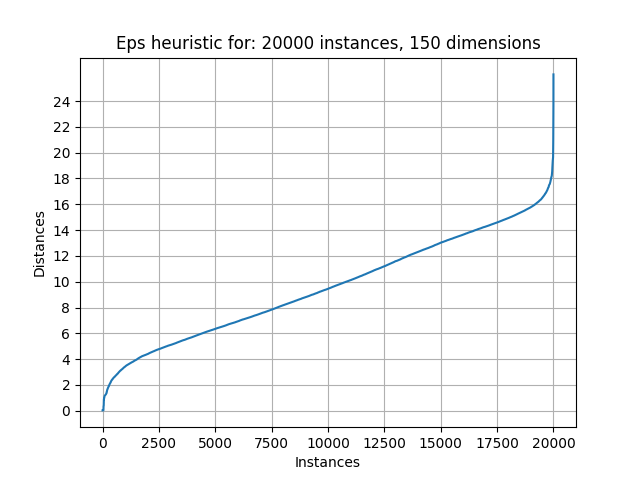

[https://radimrehurek.com/gensim/models/doc2vec.html](https://radimrehurek.com/gensim/models/doc2vec.html)

[datasets](https://drive.google.com/drive/folders/10w1BTdpTPpNzsvfYKhr-Y2R-h7G4SuJn?usp=drive_link)

[seguimiento de horas](https://docs.google.com/spreadsheets/d/1L2ZBiSUnDmHg6R7CX__1veOn-hM27sVQc-pTQLwuiZo/edit?usp=drive_link)

[documentación Overleaf](https://www.overleaf.com/project/652946916091309cffe6d295)

- [1. Introducción](#1-introducción)
- [2. Estructura del proyecto](#2-estructura-del-proyecto)
  - [2.1. main.py](#21-mainpy)
  - [2.2. reduceDataset.py](#22-reducedatasetpy)
  - [2.3. tokenization.py](#23-tokenizationpy)
  - [2.4. vectorization.py](#24-vectorizationpy)
  - [2.5. clustering.py](#25-clusteringpy)
  - [2.6. evaluation.py](#26-evaluationpy)
  - [2.7. paramOptimization.py](#27-paramoptimizationpy)
  - [2.8. dataVisualization.py](#28-datavisualizationpy)
  - [2.9. loadSaveData.py](#29-loadsavedatapy)

# 1. Introducción

|                 | Limpieza, tokenización y lematización |  doc2vec (150 dim) | sklearn.DBSCAN (epsilon:2, minPts: 2) |
|-----------------|---------------------------------------|--------------------|---------------------------------------|
|100 instances:   |                   3.2s                |          0.9s      |                   0.5s                |
|1000 instances:  |                  23.4s                |          5.8s      |                   3.7s                |
|5000 instances:  |               1m 55.7s                |         29.6s      |                  19.9s                |
|10000 instances: |               3m 56.9s                |       1m 0.9s      |        (no me acuerdo)                |
|20000 instances: |               7m 47.1s                |       2m 0.0s      |               1m 29.4s                |

# 2. Estructura del proyecto
El proyecto está dividido en diferentes módulos que siguen el siguiente esquma:

## 2.1. main.py

## 2.2. reduceDataset.py

## 2.3. tokenization.py

## 2.4. vectorization.py

## 2.5. clustering.py

## 2.6. evaluation.py

## 2.7. paramOptimization.py

## 2.8. dataVisualization.py

## 2.9. loadSaveData.py