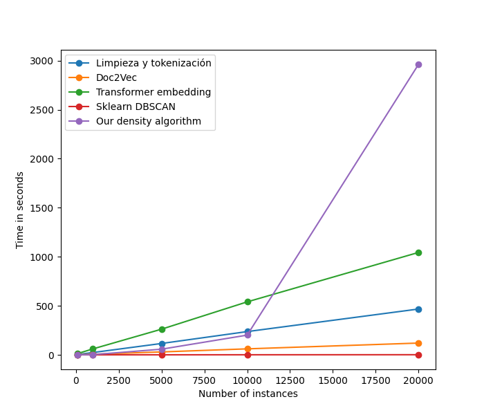

- [1. Introducción](#1-introducción)
  - [1.1. Dataset](#11-dataset)
  - [1.2. Ejecución](#12-ejecución)
    - [1.2.1. Requisitos](#121-requisitos)
    - [1.2.2. Ejecución local](#122-ejecución-local)
    - [1.2.3. Ejecución con Docker](#123-ejecución-con-docker)
- [2. Estructura del proyecto - Código fuente](#2-estructura-del-proyecto---código-fuente)
  - [2.1. Proceso prinicipal](#21-proceso-prinicipal)
    - [2.1.1. reduceDataset.py](#211-reducedatasetpy)
    - [2.1.2. tokenization.py](#212-tokenizationpy)
    - [2.1.3. vectorization.py](#213-vectorizationpy)
    - [2.1.4. clustering.py](#214-clusteringpy)
    - [2.1.5. evaluation.py](#215-evaluationpy)
  - [2.2. Proceso de inferencia](#22-proceso-de-inferencia)
    - [2.2.1. inference.py](#221-inferencepy)
  - [2.3. Módulos de utilidades](#23-módulos-de-utilidades)
    - [2.3.1. paramOptimization.py](#231-paramoptimizationpy)
    - [2.3.2. dataVisualization.py](#232-datavisualizationpy)
    - [2.3.3. loadSaveData.py](#233-loadsavedatapy)


# 1. Introducción

## 1.1. Dataset

El dataset se puede obtener de [kaggle.com/datasets/nikhileswarkomati/suicide-watch](https://www.kaggle.com/datasets/nikhileswarkomati/suicide-watch). Este dataset tiene que ser añadido a la carpeta `/Datasets`. Como prueba, se deja un archivo de 10000 instancias en la carpeta `/Datasets`.

La elección del tamaño del dataset se puede hacer teniendo en cuenta los siguientes tiempos:



## 1.2. Ejecución

### 1.2.1. Requisitos

Requisitos:
* Tener `python3` (vesión 3.10.13) instalado
* Tener `pip` instalado
* Tener `git` instalado

### 1.2.2. Ejecución local

1. Clonar el repositorio:

```bash
git clone https://github.com/Maits27/Density_Based_Clustering.git
```

2. Creamos un entorno virtual (ejemplo con venv) y entramos en él:

```bash
python -m venv .env
source .env/bin/activate
```

3. Instalar las dependencias:

```bash
cd ./Density_Based_Clustering
pip install -r requirements.txt
```

4. Instalamos el modelo necesario para tokenizar:

```bash
python -m spacy download en_core_web_sm
```

5. Descargar dataset de [kaggle.com/datasets/nikhileswarkomati/suicide-watch](https://www.kaggle.com/datasets/nikhileswarkomati/suicide-watch) y añadirlo a la carpeta `/Datasets` del proyecto.

6. Ejecutar el archivo `./src/main.py`:

```bash
cd ./src/
python main.py <numInstances> <vectorsDim> <vectorType> <algorithm> <epsilon> <minPts>
```

Donde:
* `numInstances`: número de instancias a utilizar de entrenamiento. Tiene que ser menor al número de instancias totales del dataset original.
* `vectorsDim`: número de dimensiones a utilizar. Indicar cualquier número si se usa `bert` en `vectorType`
* `vectorType`: `bert` para usar Transformers o `doc2vec` para usar Doc2Vec
* `algorithm`: `ourDensityAlgorithm` para usar nuestro algoritmo y `dbscan` para usar el de la librería `sklearn`.
* `epsilon`: valor de `epsilon` para el algortimo de Clustering.
* `minPts`: valor de `minPts` para el algoritmo de Clustering.

Recomendamos utilizar los siguientes valores que dan buenos resultados para hacer pruebas:

```bash
python main.py 10000 768 bert ourDensityAlgorithm 2.567 12
```

```bash
python main.py 10000 768 bert dbscan 0.0071 5
```

Alternativamente, se incluye `main.ipynb` para poder ejecutar el proceso paso a paso.

### 1.2.3. Ejecución con Docker

Se pide como requisito tener Docker instalado.

1. Descargar la imagen desde _DockerHub_:
```bash
docker pull sergiom8m8/density_clustering
```
2. Ejecutar imagen:

```bash
docker run -it sergiom8m8/density_clustering <numInstances> <vectorsDim> <vectorType> <algorithm> <epsilon> <minPts>
```

Los valores que pueden tomar los campos se explican en la [sección 1.2.2.](#122-ejecución-local)

# 2. Estructura del proyecto - Código fuente

## 2.1. Proceso prinicipal

El proceso principal está dividido en diferentes módulos que siguen el siguiente diagrama:


### 2.1.1. reduceDataset.py

Modulo para reducir el dataset original. Se pueden indicar los valores para un dataset `train` y un datset `test`:

```bash
python reduceDatset.py <datasetPath> <numTrainInstances> <numTestInstances> <outPath> 
```

Donde:
* `datasetPath`: ruta del dataset original. Preferiblemente en `./Datasets`.
* `numTrainInstances`: número de instancias para `train`.
* `numTestInstances`: número de instancias para `test`. La suma del número de instancias para `train` y el número de instancias para `test` no debe superar el número de instancias del dataset original.
* `outPath`: ruta para escribir los dataset `train` y `test`. Preferiblemente en `./Datasets`.

### 2.1.2. tokenization.py

Este módulo ofrece 2 tipos de tokenizaciones:

- Tokenización con limpieza:
  - Quita los emojis
  - Quita las palabras 'filler' y 'filer'
  - Quita las palabras de más de 3 tokens
  - Quita los stopwords
  - Quita todos los carácteres especiales
  - Lematiza los tokens
  - Pasa a minúscula todos los tokens 
- Tokenización sin limpieza

### 2.1.3. vectorization.py

Este módulo ofrece 2 tipos de vectorizaciones:

- Doc2Vec
- Vectorización mediante Transformers

### 2.1.4. clustering.py

Este módulo ofrece 2 tipos de algoritmo:

- Nuestro algoritmo de densidad
- Algoritmo de DBSCAN implementado por SKLEARN

### 2.1.5. evaluation.py

Este módulo ofrece varios tipos de evaluación:

- Métricas internas:
  - Rand Index
  - Jaccard Score
  - Fowlkes Mallows Score
  - Silhouette
- Pair-Wise-Evaluation entre dos modelos de clustering
- Class-to-cluster evaluation
- Generación de WordClouds
- Conseguir muestras de los clusters

## 2.2. Proceso de inferencia

El de inferencia utiliza los módulos del siguiente diagrama:


### 2.2.1. inference.py

Es el módulo con las funciones y utilidades para realizar la inferencia, es decir, clasificar instancias nuevas a clusters previamente calculados.

## 2.3. Módulos de utilidades

Son módulos auxiliares utilizados por otros módulos para tareas concretas.

### 2.3.1. paramOptimization.py

Es el módulo con las herramientas para optimizar los parámetros `epsilon` y `minPts`

### 2.3.2. dataVisualization.py

Contiene las utilidades para representación visual de los datos:

- Distribución de la clase
- Distribución de pares de instancias
- Visualización PCA
- Visualización t-SNE

### 2.3.3. loadSaveData.py

Contiene las herramientas para guardar y cargar archivos con tokens, embeddings, distancias, clusters y resultados de ejecuciones de optimización.
